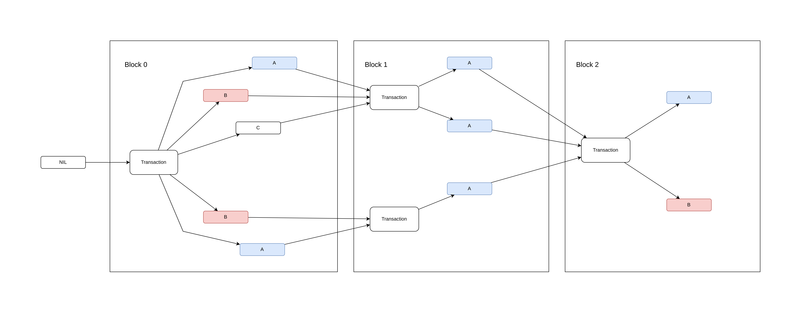

# The Task



## Description

Your task is to write a server to process two types of queries:
1. `CountCycles(fromBlock, toBlock, maxCycleLength) -> NumberOfCycles`
   * `fromBlock` - the block to start the search (inclusive).
   * `toBlock` - the block to search up to (inclusive).
   * `maxCycleLength` - the maximum length of the cycle allowed.
2. `MineBlock(transactions) -> -1`
   * `transactions` - transactions to batch into block and append to the graph.


## Input/Output Examples

We will take as an example the input data as pictured in the figure above.

```
CountCycles(0, 0, 1) -> 0
   Graph is empth - 0 cycles.

MineBlock(transactions_from_block_0) -> -1
CountCycles(0, 0, 1) -> 0
   Still no cycles.

MineBlock(transactions_from_block_1) -> -1
CountCycles(0, 0, 1) -> 0
CountCycles(0, 1, 1) -> 3
CountCycles(0, 1, 0) -> 0
CountCycles(1, 1, 1) -> 0

MineBlock(transactions_from_block_2) -> -1

CountCycles(0, 2, 2) -> 11
    Let's first consider upper 4 blue addresses (1 in block 0, 2 in block 1, 1 in block 2):
        0-1 blocks: 2 cycles
        1-2 blocks: 2 cycles
        0-2 blocks: 2 cycles
    Now let's consider lower branch of blue addresses (1 in each block):
        0-1 blocks: 1 cycle
        1-2 blocks: 1 cycle
        0-2 blocks: 1 cycle
    And finally the red addresses:
        0-2 blocks: 2 cycles
    Total of 11 cycles
    
CountCycles(0, 2, 1) -> 6
    We can count in similarlly:
    Upper 4 blue addresses:
        0-1 blocks: 2 cycles
        1-2 blocks: 2 cycles
        0-2 blocks: 0 cycles
    Lower branch of blue addresses:
        0-1 blocks: 1 cycle
        1-2 blocks: 1 cycle
        0-2 blocks: 0 cycle
    Red addresses:
        0-2 blocks: 0 cycles
    Total of 6 cycles
   
        
CountCycles(1, 2, 1) -> 3
```